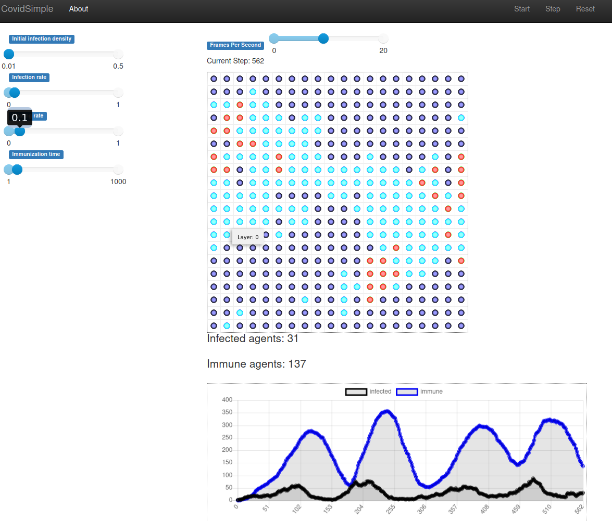

# Covidsims

The purpose of this repo is exploring virus propagation using different simulations based on the [mesa framework](https://github.com/projectmesa/mesa/).

## Getting started

* Clone the repository
* Install the requirements (recommended to use a venv): `pip install -r requirements.txt`
* Start the mesa server: `cd mesa && mesa runserver`
* A browser window should pop up and you can start experimenting!

